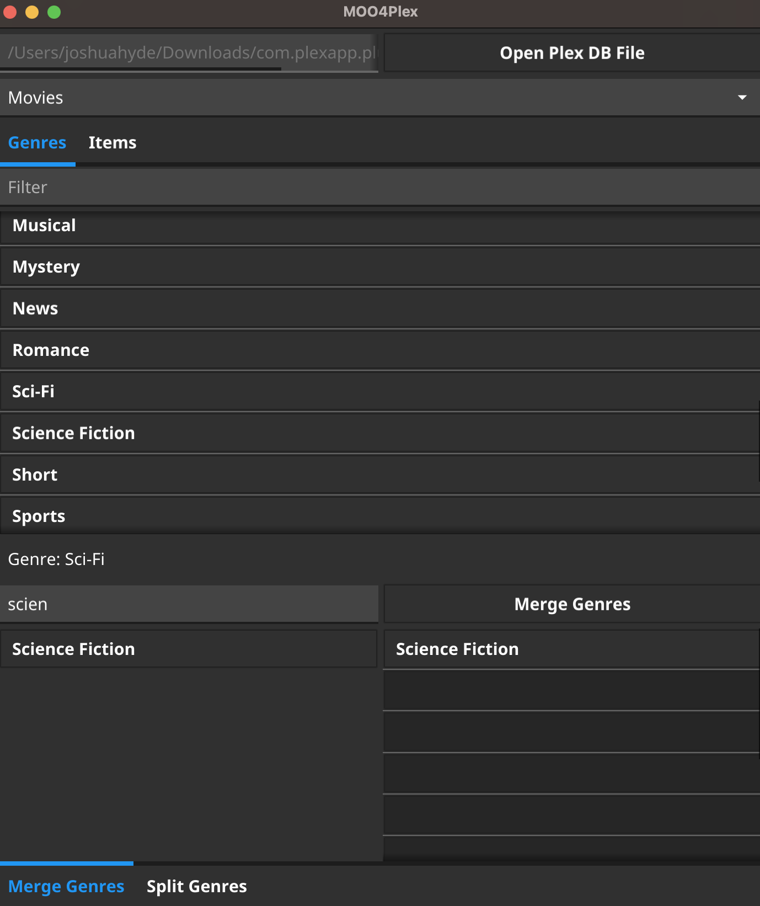

# moo4plex
moo4plex is a Multimedia Organizer/Optimizer for Plex. It allows the modification of metadata that Plex either does not expose via its web UI or does not expose as well as one might like.

**DISCLAIMER**: this tool operates by performing operations directly against the sqlite database that backs Plex. This is not a supported workflow by Plex. Treat this as a way for things to go very, very wrong - make backups of the database before doing anything, and test thoroughly after you have made the changes available to Plex. If this tool breaks something in your Plex database, feel free to submit a bug, but I will not fix your database if you did not back it up. Plex will not fix your database, even if you did back it up. The workflows in this tool are provided completely without warranty or promise of support.

## Usage

This tool operates against the sqlite database that Plex uses to store its metadata. You can find the `com.plexapp.plugins.library.db` file containing the media metadata by consulting [this document](https://www.plexopedia.com/plex-media-server/general/plex-database-location/). Once located, open the database using this tool and begin your desired work.

## Supported Metadata Categories

At present, this only supports the merging of genres.

## Genres

### Merging

Sometimes, you can end up with a metadata agent describing the same genre in multiple ways. While you can try to find all the offenders in Plex and manually edit the offenders to have the desired single genre, this is time-consuming and tedious. Enter MOO, which allows you to coalesce a set of genres into a single genre:

This will _not_ delete the actual genres, as special field metadata in the Plex database prevent this, but it will disassociate media items from the duplicate genres and associate them to the given genre, leaving it up to Plex to garbage collect the unused genres.