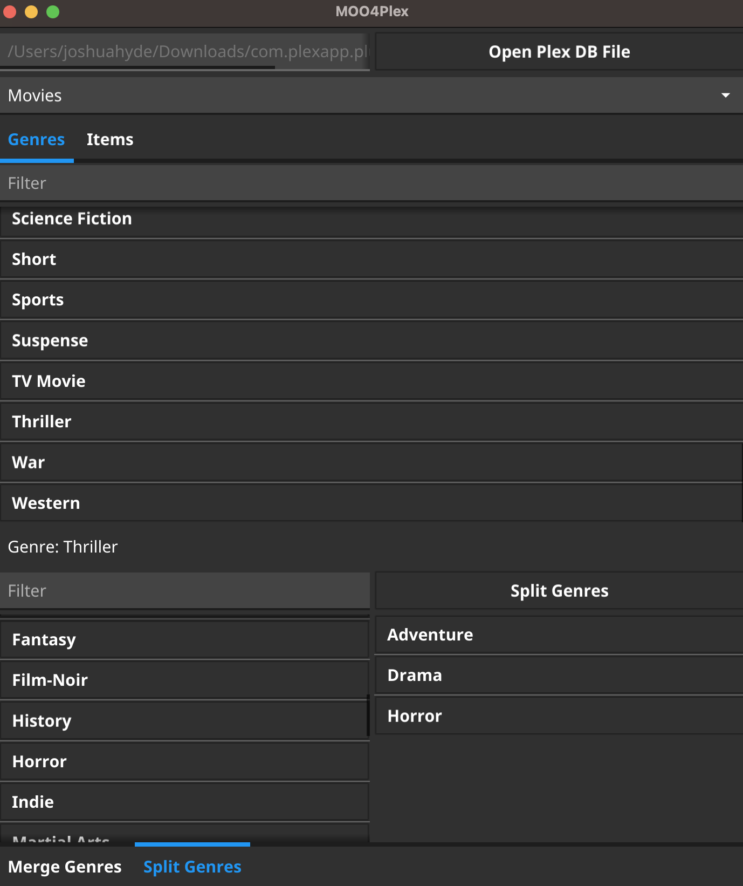
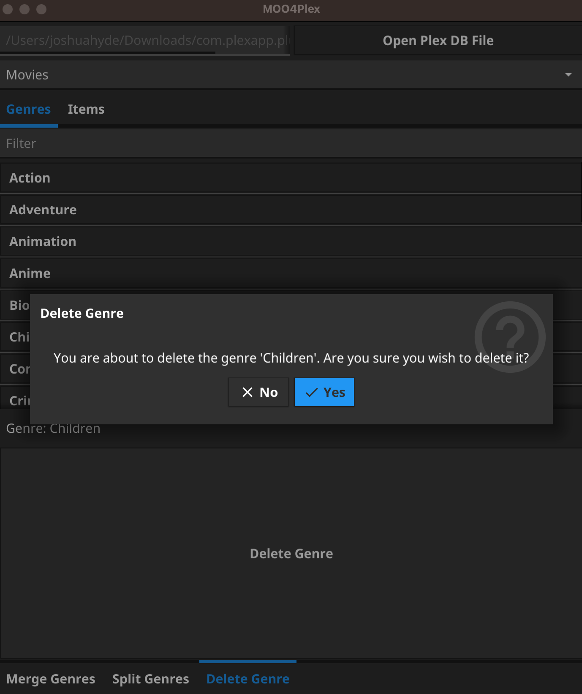
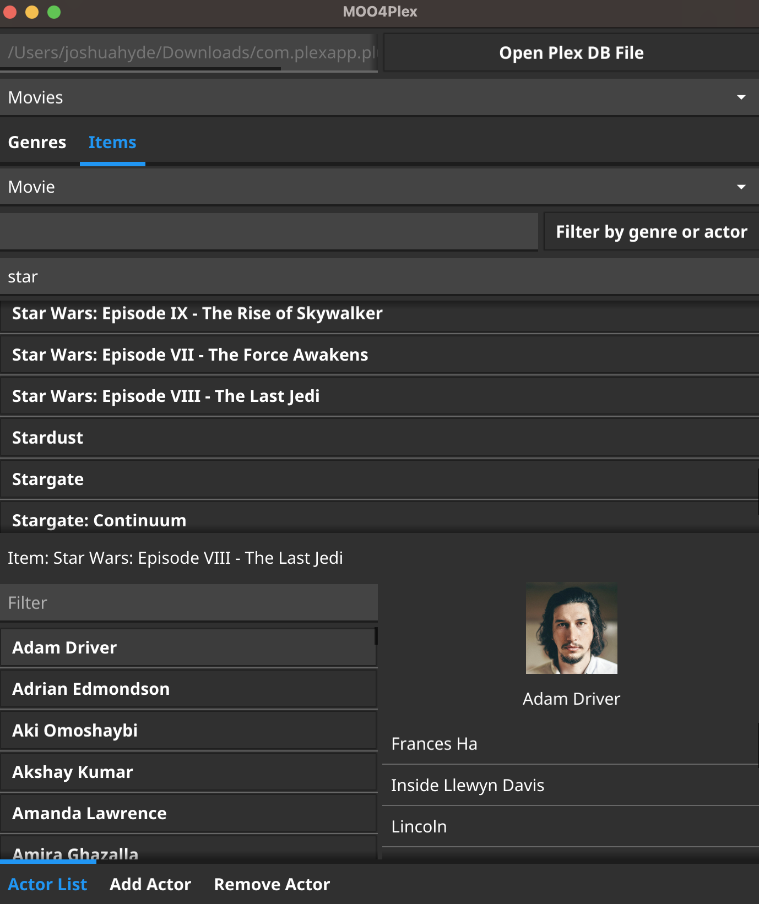

# moo4plex
moo4plex is a Multimedia Organizer/Optimizer for Plex. It allows the modification of metadata that Plex either does not expose via its web UI or does not expose as well as one might like.

Application icon has been sourced from [here](https://openclipart.org/detail/17676/cartoon-cow).

**DISCLAIMER**: this tool operates by performing operations directly against the sqlite database that backs Plex. This is not a supported workflow by Plex. Treat this as a way for things to go very, very wrong - make backups of the database before doing anything, and test thoroughly after you have made the changes available to Plex. If this tool breaks something in your Plex database, feel free to submit a bug, but I will not fix your database. Plex will not fix your database, even if you did back it up. The workflows in this tool are provided completely without warranty or promise of support.

## Usage

This tool operates against the sqlite database that Plex uses to store its metadata. You can find the `com.plexapp.plugins.library.db` file containing the media metadata by consulting [this document](https://www.plexopedia.com/plex-media-server/general/plex-database-location/). Once located, open the database using this tool and begin your desired work.

## Supported Metadata Categories

## Genres

You can use this tool to merge genres (replacing multiple genres with a single genre), split genres (replacing a single genre with multiple genres), and delete genres. This can only work with existing genres; this tool cannot add new genres. If you need a new genre, add it through Plex's UI and then load the database with this tool.

### Merging

Sometimes, you can end up with a metadata agent describing the same genre in multiple ways. While you can try to find all the offenders in Plex and manually edit the offenders to have the desired single genre, this is time-consuming and tedious. Enter MOO, which allows you to coalesce a set of genres into a single genre:

This will _not_ delete the actual genres, as special field metadata in the Plex database prevent this, but it will disassociate media items from the duplicate genres and associate them to the given genre, leaving it up to Plex to garbage collect the unused genres.

### Splitting

There are situations where you may end up with duplicate genres, where a single genre can be better-represented as two or more distinct genres. You can use MOO to replace the instances of that single genre tag with two or more other genres:

This will _not_ delete the actual genre being 'split', as special field metadata in the Plex database prevent this, but it will disassociate media items from the selected genre and associate them to the given split genres, leaving it up to Plex to garbage collect the unused genre.

### Deleting

Sometimes, a metadata agent will add genres that you don't find a use for. While you can go through each item and delete the genre manually, that's very slow and tedious. MOO will let you delete a single genre by clicking a very large button:

This will _not_ delete the actual genre, as special field metadata in the Plex database prevent this, but it will disassociate media items from the selected genre, leaving it up to Plex to garbage collect the now-unused genre.

## Items

At present, the only supported media items for modification are movies and television series.

You can use this tool to add and remove actors to and from movies and television series.

